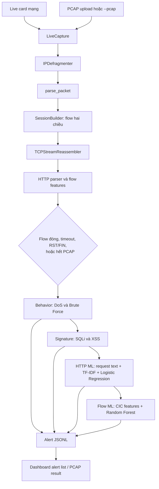

# Hướng dẫn đọc kiến trúc và bảo vệ đồ án IDS

Tài liệu này đi theo đường đi của dữ liệu trong source hiện tại. Khi trình bày, hãy bắt đầu bằng một packet, giải thích cách nhiều packet thành flow, rồi nói đến bốn detector và nơi lưu alert.

## 1. Câu trả lời ngắn để mở đầu khi bảo vệ

> Hệ thống nhận traffic theo hai cách: bắt packet trực tiếp hoặc đọc PCAP. Mỗi packet được chuẩn hóa, gộp vào một flow hai chiều theo địa chỉ/port/protocol, TCP payload được ghép lại để nhận ra HTTP request/response. Khi flow đóng, pipeline chạy behavior, signature, TF-IDF/Logistic Regression cho từng HTTP request và Random Forest cho đặc trưng flow. Các detector ghi alert gồm IP nguồn, loại tấn công, engine phát hiện, mức độ, bằng chứng và thời gian. Dashboard hiển thị alert live hoặc kết quả PCAP riêng.

## 2. Sơ đồ tổng quát



Hai đường input dùng chung `LiveCapture`, `SessionBuilder` và pipeline detector. Khác nhau ở chỗ live nhận packet từ Scapy và có dashboard start/stop; offline đọc tuần tự packet trong tệp rồi finalize các flow còn mở khi hết tệp.

## 3. Các khái niệm cần nắm

- **Packet**: một gói mạng riêng lẻ. Nó có thể chỉ chứa SYN/ACK, một phần HTTP header, hoặc một phần body.
- **Flow/session**: tập packet cùng cặp endpoint và protocol. Khóa flow không phân biệt chiều; chiều packet đầu tiên được gọi là `forward`, chiều ngược lại là `backward`.
- **HTTP transaction**: một request và response tương ứng. Một TCP keep-alive flow có thể chứa nhiều transaction.
- **Detector**: một nhánh phát hiện độc lập. Behavior tìm hành vi theo cửa sổ nhiều flow; signature tìm chuỗi payload; request ML phân lớp văn bản HTTP; flow ML phân lớp các đặc trưng số của flow.
- **Alert**: bản ghi kết quả, không phải packet. Có thể có nhiều alert cho cùng một flow nếu nhiều engine cùng phát hiện.

Session hiện tại lưu các nhóm chính: `timestamp`, `network`, `flag`, `packets`, `flow`, `http`, `connection`. Các khóa bắt đầu bằng `_` là trạng thái nội bộ và bị loại khỏi snapshot/JSON.

### Một request đi qua code ra sao?

Ví dụ trình duyệt `10.0.0.5:51000` gửi HTTP đến victim `10.0.0.20:8080`:

1. Packet SYN đầu tiên tạo flow mới. `network.src_ip/src_port` ghi endpoint đầu tiên, và endpoint đó thành forward.
2. SYN-ACK từ victim thuộc cùng flow vì `_get_flow_key()` sắp xếp endpoint; nó được tính là backward.
3. HTTP request có thể đến thành nhiều TCP segment. Sequence number giúp reassembler nối đúng thứ tự và bỏ byte retransmission.
4. Khi đủ header/body, HTTP parser thêm transaction có `request.method`, `request.uri`, `request.body`.
5. Response được parse ở chiều backward, tăng `response_count`, rồi gắn vào request đang chờ gần nhất.
6. Hai phía FIN, một RST, timeout, hoặc finalize kết thúc flow. Snapshot bỏ trạng thái nội bộ rồi được đưa đến behavior, signature, request ML và flow ML.
7. Mỗi detector nếu phát hiện thì gọi wrapper alert tương ứng. Record JSON có `src_ip`, `attack_type`, `engine`, `severity`, `evidence`, `timestamp`, `alert_id`.

Nếu client gửi thêm request trên cùng keep-alive TCP connection, bước 3–5 lặp lại và thêm transaction khác; không tạo flow mới cho đến khi flow đóng/timeout/rotation.

## 4. Đọc code theo đúng thứ tự chạy

### 4.1 Entry point: `ids/main.py`

- `_parse_args()` đọc lựa chọn card mạng, BPF filter, timeout, thời lượng tối đa và đường dẫn PCAP.
- `_consume_packet_queue(capture)` là worker lấy từng packet khỏi queue, gọi `capture.process_packet()` rồi gọi `task_done()`. Lệnh `queue.join()` ở main nhờ tín hiệu này biết khi nào đã xử lý hết packet đang chờ.
- `main()` nạp `config/rules.json`, tạo `LiveCapture`, rồi chọn live hoặc offline. Callback `process_closed_session()` bảo đảm flow đóng đi vào cùng pipeline.

Dashboard gọi trực tiếp API của `dashboard/app.py`; `ids/main.py` là lựa chọn chạy capture từ terminal.

Ví dụ dùng terminal ở project root:

```powershell
python -m ids.main --pcap .\data\example.pcap
python -m ids.main --interface "<tên-card>" --filter "tcp or udp or icmp" --timeout 120 --max-duration 120
```

`--timeout` quyết định khoảng idle để đóng flow; `--max-duration` cắt flow dài để không giữ mãi một session. Chạy live cần dừng bằng `Ctrl+C` để chương trình drain queue và finalize flow.

### 4.2 Nhận và điều phối packet: `ids/capture/live_capture.py`

`LiveCapture` là lớp nối Scapy với các bước xử lý IDS.

- `__init__()` tạo queue, `SessionBuilder`, bộ ghép IP fragment, counter và callback. `on_session` là hàm được gọi khi có session cần phân tích. `flush_on_stop` cho phép caller quyết định lúc nào finalize session.
- `put_packet(packet)` là callback tối giản cho Scapy: đưa packet vào queue để capture không phải chạy detector ngay trong luồng nhận gói.
- `process_packet(packet)` là entry point xử lý một packet: tùy chọn loại bản sao, ghép IP fragment, parse packet, đếm traffic, cập nhật session, autosave và phát session vừa đóng đến callback.
- `_log_packet(parsed)` in thông tin packet và HTTP khi debug bằng console.
- `_maybe_autosave()` định kỳ dọn fragment hết hạn, đóng flow idle, gửi các flow timeout vào detector, ghi session/counter và dọn session đã đóng.
- `_autosave_worker()` chạy chu kỳ autosave ở background khi live.
- `start()` tạo `AsyncSniffer` cho interface/filter đã chọn và chờ đến khi stop.
- `stop()` báo dừng capture và yêu cầu Scapy dừng sniffer.
- `traffic_stats()` trả số packet đã parse, tốc độ packet trong một giây gần nhất và số flow đang giữ để Dashboard hiển thị.
- `flush()` đóng mọi flow còn mở, gửi callback, lưu session/counter và dọn bộ nhớ.
- `read_pcap(pcap_path)` đọc packet tuần tự bằng Scapy `rdpcap`, xử lý từng packet, rồi finalize các flow chưa có FIN/RST trước khi trả danh sách session.
- `_emit_session(session)` gọi `on_session` cho một flow đã đóng.
- `_emit_sessions(session_ids)` lấy snapshot của các flow theo ID rồi gọi callback; được dùng cho timeout và flush.
- `get_sessions(only_closed)` lấy snapshot session, có thể lọc chỉ flow đóng.
- `save_sessions(only_closed)` ghi session dạng JSON Lines.
- `save_session_counter()` lưu bộ đếm ID để lần chạy sau không bắt đầu lại từ đầu.
- `load_session_counter()` nạp bộ đếm ID cũ; file chưa có hoặc không phải số thì bắt đầu từ 0.

**Vì sao cần queue?** Capture cần nhận packet liên tục. Queue tách công việc nhận packet khỏi công việc ghép flow và chạy detector; nếu xử lý nặng ngay trong callback nhận gói, nguy cơ rớt packet tăng.

### 4.3 Chuẩn hóa packet: `ids/capture/packet_parser.py`

- `get_timestamp(packet)` lấy timestamp Scapy; nếu thiếu thì lấy thời điểm hiện tại.
- `get_ip_layer(packet)` tìm IPv4/IPv6 layer.
- `get_protocol(packet)` nhận diện TCP, UDP, ICMP hoặc ICMPv6.
- `_parse_headers(lines)` tách HTTP header thành dictionary chữ thường.
- `extract_http_request(payload)` đọc request line, host, body và số liệu payload/query.
- `extract_http_response(payload)` đọc status code và độ dài body response.
- `extract_http(payload)` thử parse request trước, rồi response.
- `parse_packet(packet)` chuyển Scapy packet thành dictionary thống nhất: timestamp, endpoint, protocol, độ dài packet, TCP flags, sequence number, window và payload. Đây là hợp đồng đầu vào của `SessionBuilder`.

### 4.4 Ghép IP fragment: `ids/capture/ip_reassembly.py`

- `IPDefragmenter.__init__()` tạo bảng fragment đang chờ.
- `_group_key(ip_layer)` nhóm các mảnh cùng source, destination, protocol và IP ID.
- `process(packet)` trả packet nguyên nếu không fragment; nếu là fragment thì giữ lại đến khi đủ các mảnh.
- `_try_build(group)` kiểm tra khoảng byte đã phủ đủ chưa, sau đó dựng lại IP packet.
- `cleanup(current_time)` xóa nhóm fragment quá hạn để tránh giữ mãi nhóm không hoàn chỉnh.

Đoạn này mới xử lý IPv4 fragment; IPv6 fragment không được ghép bởi lớp này.

### 4.5 Ghép TCP/HTTP: `ids/capture/tcp_reassembly.py`

Mỗi session có một `TCPStreamReassembler`, và mỗi chiều forward/backward có buffer riêng.

- `__init__()` tạo buffer, sequence kế tiếp và danh sách segment đến sớm.
- `feed(direction, payload, sequence)` sắp xếp payload theo TCP sequence, bỏ byte retransmission/overlap, nối segment liên tục rồi lấy ra HTTP message hoàn chỉnh.
- `_order_payload(direction, payload, sequence)` quyết định segment đến đúng thứ tự, đến sớm, hay là bản gửi lại.
- `_message_length(header_section, body_start, buf)` xác định ranh giới dựa trên Content-Length, chunked, response không body hoặc response đóng theo FIN.
- `_chunked_end(buf, body_start)` tìm điểm kết thúc body HTTP chunked.
- `_extract_content_length(header_section)` đọc Content-Length nếu có.
- `flush(direction)` trả byte còn giữ khi FIN/RST hoặc khi caller finalize stream.

Cần reassembly vì một HTTP request có thể bị TCP chia thành nhiều packet; parse từng packet riêng sẽ thấy header/body thiếu và không phát hiện được chuỗi tấn công.

### 4.6 Xây session và đặc trưng flow: `ids/capture/session_builder.py`

`SessionBuilder` biến packet đã parse thành flow record gần dạng CICFlowMeter ở **67 đặc trưng được trainer sử dụng**.

- `_synchronized(method)` decorator khóa các thao tác đọc/ghi session để autosave và packet worker không sửa dictionary cùng lúc.
- `__init__()` tạo bảng session, flow key đang hoạt động, timeout và giới hạn thời lượng.
- `_new_session_id()` cấp ID tăng dần.
- `_get_flow_key(packet)` sắp xếp hai endpoint để request và response thuộc cùng flow bất kể chiều packet.
- `_create_session(packet, ...)` khởi tạo schema và thống kê rỗng cho flow mới.
- `_update_tcp(session, packet)` cộng cờ TCP, ghi hướng FIN, đóng ngay khi RST hoặc khi cả hai phía đã FIN.
- `_update_icmp(session, packet)` cộng ICMP count/type/code.
- `_get_direction(session, packet)` so source endpoint với endpoint của packet đầu flow.
- `_update_direction(session, direction, packet)` cộng số packet và byte cho forward/backward.
- `_update_init_window(session, direction, packet)` ghi TCP window đầu tiên từng chiều.
- `_feed_tcp_stream(session, direction, packet)` chuyển TCP payload vào reassembler, parse message hoàn chỉnh rồi cập nhật HTTP transaction.
- `_apply_http_result(session, http)` tăng request/response count; response gắn vào request gần nhất chưa có response.
- `add_packet(packet)` là đường cập nhật chính: lấy/tạo flow, cập nhật timestamp/duration, counters, length/IAT, direction, protocol, HTTP và rates.
- `_get_or_create_session(flow_key, timestamp, packet)` tái dùng flow đang hoạt động hoặc tạo flow mới nếu chưa có, đã đóng, timeout hay vượt max duration.
- `_welford(count, mean, m2, value)` cập nhật mean/phương sai trực tuyến mà không cần giữ toàn bộ packet length/IAT.
- `_accumulate_length(session, length)` cập nhật min/max/mean/std chiều dài packet.
- `_accumulate_iat(session, timestamp)` cập nhật khoảng cách thời gian giữa hai packet liên tiếp.
- `_update_statistics(session)` tính bytes/s, packets/s, packet length stats và IAT stats.
- `close_expired_sessions(current_time)` đóng flow idle quá timeout.
- `close_all_sessions()` đóng tất cả flow đang mở khi capture dừng/PCAP kết thúc.
- `get_sessions(only_closed)` trả các bản sao đã bỏ trường nội bộ.
- `count_sessions()` trả số session hiện được giữ.
- `_clean(session)` loại các trường `_internal` khỏi bản ghi dùng ngoài.
- `snapshot(session)` tạo bản sao độc lập của một session.
- `clear_closed_sessions()` xóa flow đã đóng khỏi RAM và xóa ánh xạ flow tương ứng.

**Direction trong hiện thực:** `forward` lấy từ source của packet đầu tiên quan sát được. Nếu bắt capture giữa một kết nối, packet đầu tiên có thể không phải client SYN; khi đó hướng không nhất thiết là client→server.

**Cách tính thống kê:** duration = thời điểm packet cuối − thời điểm đầu. Dashboard giữ bytes IP/s; vector ML có `cic_bytes_per_second` tính từ tổng payload TCP/UDP chia duration. IAT là hiệu timestamp packet hiện tại với packet ngay trước đó. `_welford()` cập nhật `count`, `mean`, `M2` tăng dần; ML dùng sample std `sqrt(M2 / (count - 1))` khi có ít nhất hai giá trị. Nhờ vậy builder không cần giữ danh sách toàn bộ packet length/IAT trong RAM.

### 4.7 Chạy bốn engine theo thứ tự: `ids/detection_pipeline.py`

- `process_closed_session(session, rules)` chạy lần lượt behavior → signature → HTTP request ML → flow ML. Mỗi engine có `try/except` riêng để lỗi ở một nhánh không ngăn các nhánh sau. Hàm trả tên engine lỗi để log/quan sát.

Chỉ flow đã đóng hoặc được finalize mới tới hàm này. Vì vậy IDS không dự đoán ML lại sau từng packet trong cùng session.

## 5. Mỗi detector làm gì?

### 5.1 Behavior: `ids/detectors/behavior/`

`behavior_engine.py` giữ các session gần đây trong cửa sổ `TIME_WINDOW` (mặc định 120 giây), rồi đưa snapshot cho detector.

- `isolated_behavior_state()` tạo bộ nhớ behavior riêng cho một lượt PCAP để không trộn lịch sử PCAP với live.
- `behavior_engine(session, rules)` thêm flow mới vào cửa sổ, dọn session cũ, tạo snapshot rồi gọi Brute Force và DoS detector.
- `remove_old_sessions(current_time, store)` xóa entry ngoài cửa sổ.
- `get_sessions(store)` lấy danh sách session từ store.

`brute_force_detector.py`:

- `detect_brute_force(sessions, rules, window_seconds)` đếm transaction `POST /login` trả HTTP 401 theo IP. Nó cảnh báo khi vượt `MAX_FAILED_LOGINS` hoặc tốc độ thất bại vượt `BRUTE_FORCE_REQUEST_RATE_THRESHOLD`.

`dos_detector.py`:

- `detect_SYN_Flood(sessions, threshold)` cộng SYN theo IP nguồn và so ngưỡng.
- `detect_UDP_Flood(sessions, count_threshold, byte_threshold)` cộng forward UDP packet/byte theo IP nguồn.
- `detect_ICMP_Flood(sessions, count_threshold, byte_threshold)` cộng ICMP packet/byte và so ngưỡng.
- `detect_HTTP_Flood(...)` tổng hợp HTTP request, tốc độ và thời lượng theo IP; có nhánh HTTP flood và slow HTTP.
- `detect_dos(sessions, rules, window_seconds)` đọc ngưỡng trong JSON rồi gọi các detector con.

**Điểm cần nói chính xác:** Brute Force hiện nhận biết dựa trên URL `/login` và status 401. Nếu một ứng dụng login khác dùng route/status khác, cần cấu hình hoặc sửa detector. Ngưỡng DoS là heuristic theo rules, không phải ngưỡng đúng cho mọi mạng.

### 5.2 Signature: `ids/detectors/signature/`

- `signature_engine(session, rules)` gọi cả detector SQLi và XSS.
- `sqli_detector.normalize_payload(payload)` URL-decode nhiều lần, chuyển chữ thường và gộp whitespace.
- `sqli_detector.detect_sqli(session, rules)` lấy URI/body từ HTTP transaction, so với regex `SQLI_PATTERNS`, gọi alert khi khớp.
- `xss_detector.normalize_payload(payload)` chuẩn hóa URI/body theo cách tương tự.
- `xss_detector.detect_xss(session, rules)` so payload với `XSS_PATTERNS`, gọi alert khi khớp.

Signature có thể phát hiện chuỗi nhìn thấy được trong HTTP. Nó không giải mã HTTPS/TLS, không đảm bảo nhận diện mọi biến thể obfuscation, và regex có thể sinh false positive/false negative.

### 5.3 Machine learning: `ids/detectors/ml/`

- `feature_extractor(session)` chuyển flow đã ghép thành 67 giá trị theo đúng tên và thứ tự `CIC_FEATURES`. Duration và IAT được biểu diễn bằng microseconds; tốc độ gói/byte theo giây; độ dài và header theo byte. Destination Port giữ nguyên cổng thực tế trong packet.
- `ml_engine(session)` bỏ flow chỉ có một packet, tạo DataFrame có đủ tên cột, gọi model `predict`/`predict_proba`, rồi áp `ML_ALERT_THRESHOLD` để bổ sung alert khi nhãn thô là BENIGN nhưng xác suất lớp tấn công lớn hơn ngưỡng.
- `SessionBuilder` bổ sung thống kê payload packet theo chiều, IAT từng chiều, header length, PSH/URG theo chiều, CWR/ECE, packet size/ratio, active/idle và min segment size. Các thống kê online dùng Welford để không phải giữ toàn bộ packet trong RAM.

`CIC_FEATURES` trong `ids/detectors/ml/features.py` là schema duy nhất cho flow trainer và runtime. Nó có 67 cột, đều được lấy từ CSV CIC-IDS-2017/2018; feature HTTP như request rate/URI không nằm trong Random Forest vì các CSV nhãn hiện có không cung cấp các feature ứng dụng tương ứng. HTTP được reassemble và chuyển tới signature cùng model request-text riêng.

Các nhóm feature hiện tại:

| Nhóm | Ví dụ | Mục đích |
|---|---|---|
| Flow cơ bản | duration, packet count, payload bytes, packet/byte rate | Quy mô và tốc độ flow |
| Packet length theo chiều | Fwd/Bwd min, max, mean, std; tổng hợp toàn flow | Phân biệt mẫu gói client và server |
| IAT theo chiều | Flow/Fwd/Bwd total, mean, std, min, max | Nhịp gửi và độ đều của traffic |
| Header và cờ TCP | header length, PSH/URG theo chiều, FIN/SYN/RST/ACK/CWR/ECE | Mẫu điều khiển và truyền dữ liệu |
| Tóm tắt flow | down/up ratio, average packet/segment size, active/idle | Tỷ lệ hai chiều và khoảng hoạt động |
| TCP khởi tạo | Init window, active forward data packets, min forward segment size | Đặc điểm khởi tạo và payload |

#### Quy tắc cập nhật feature theo packet

1. `packet_parser.parse_packet` đọc IP/TCP/UDP; payload length không bao gồm header; header length TCP/UDP được ghi riêng. Timestamp được giữ dạng giây cho timeout và integer microsecond cho CIC features.
2. Packet đầu tiên trong flow thiết lập forward direction và khởi tạo các running statistics. Gói tới từ endpoint đối diện được tính backward.
3. Mỗi packet cập nhật số gói, payload bytes, phân bố độ dài, header bytes và cờ theo chiều. Với packet thứ hai trở đi trong một chiều, thời gian từ packet trước cùng chiều được thêm vào directional IAT.
4. Active/idle chia theo ngưỡng 5 giây. Các thống kê được xuất ở lúc session được đóng; vector được dựng bởi `feature_extractor`.
5. Trainer đọc đúng các cột CIC có sẵn, chuẩn hóa alias, rồi huấn luyện model với cùng tên/cùng thứ tự feature. Runtime truyền DataFrame có tên cột để sklearn kiểm tra schema.

Đây là subset 67 feature trong bộ CICFlowMeter 78 cột, không có nghĩa các feature ứng dụng HTTP đã được học. Cách tính runtime được xây dựng theo quy ước CICFlowMeter nhưng phụ thuộc độ chính xác timestamp, version, packet visibility và timeout. Cần xác nhận bằng cùng một PCAP và đúng bản CICFlowMeter trước khi nói các giá trị khớp bit-for-bit.

### 5.4 Request-level ML: `ids/detectors/ml/request_text_engine.py`

- `format_request_text(method, uri, body)` ghép request theo đúng thứ tự `method + " " + uri + " " + body`; body rỗng thì chuỗi kết thúc ở URI. HTTP version và headers không được đưa vào model.
- `request_text_engine(session, rules)` duyệt từng transaction trong session đã đóng. Nó lấy xác suất XSS và SQLi, chọn lớp có xác suất cao hơn, rồi chỉ tạo alert khi xác suất đó đạt `REQUEST_TEXT_ALERT_THRESHOLD` (mặc định 0.6 trong `config/rules.json`). Dưới ngưỡng, request được coi là BENIGN.
- Alert do model request-text tạo lưu nguyên chuỗi `request_text` cùng model confidence trong trường `evidence` của `alerts.json`; dashboard và trang kết quả offline hiển thị trường này.
- `ml/request_text_training.py::load_dataset(path)` đọc hai cột `request_text`, `label`, bỏ dòng thiếu và chấp nhận ba nhãn BENIGN, SQLi, XSS.
- `build_model()` ghép word n-gram và character n-gram TF-IDF, rồi dùng Logistic Regression cân bằng lớp. Pipeline được lưu bằng joblib tại `ml/request_text_model.joblib`.
- `train_request_model(...)` báo cáo stratified random holdout 20%, fit lại trên toàn bộ dataset rồi ghi model. `main()` in tiến trình ra terminal và lưu vào `reports/request_text_training.log`.

> **Giới hạn đánh giá:** Dataset request hiện là dữ liệu tổng hợp. Holdout ngẫu nhiên có thể để các biến thể cùng họ nằm cả train lẫn test và cho điểm lạc quan. Cần đánh giá bằng request thật, độc lập, đã gán nhãn; không dùng điểm holdout tổng hợp làm bằng chứng hiệu quả live.

Model được nạp lazy từ `ml/request_text_model.joblib` và runtime theo dõi thời điểm sửa file để nạp lại model sau lần train kế tiếp. Nếu model chưa tồn tại, nhánh request ML log cảnh báo rồi bỏ qua, các detector khác vẫn chạy.

### 5.5 Training flow model: `ml/`

- `read_cic_csv(path)` đọc theo chunk và chỉ giữ Label cùng 67 cột ML cần thiết; vì vậy không phải giữ hơn 50 cột không dùng trong RAM. Hàm nhận hai dạng header của CIC-IDS-2017 và CICFlowMeter-V3 (CIC-IDS-2018).
- `normalize_columns(data)` đổi các alias như `Dst Port`, `Tot Fwd Pkts`, `Flow Byts/s`, `FIN Flag Cnt` về tên chuẩn dùng lúc live.
- `data_processing(data)` làm sạch tên cột/nhãn, gộp DoS Hulk/GoldenEye thành `HTTP Flood`, gộp DoS slowloris/Slowhttptest thành `HTTP slow`, đổi Web brute-force/XSS/SQLi về lớp thống nhất, giữ nhãn FTP/SSH riêng, bỏ Heartbleed, đổi feature thành số và thay Inf/NaN bằng 0.
- `CIC_FEATURES` là schema chung 67 cột và thứ tự vector. Đây là hằng số, không phải hàm.
- `load_dataset(data_dir)` tìm CSV đệ quy, đọc từng file qua `read_cic_csv`, in số lượng lớp từng nguồn và gắn tên nguồn để đánh giá chéo.
- `validate_dataset(data)` kiểm tra cột feature, lớp BENIGN/XSS/SQLi/Brute Force/DoS và số mẫu tối thiểu trước khi train.
- `build_model(n_estimators=160)` cấu hình Random Forest entropy, class weight cân bằng, dùng bootstrap 40% flow mỗi cây để giữ thời gian/ram phù hợp với CSV hàng triệu dòng. Holdout/cross-source dùng 80 cây; model cuối dùng 160 cây.
- `_report(...)` in precision/recall/F1 và confusion matrix theo lớp.
- `_cross_dataset_report(data)` chỉ fit tạm trên CIC-IDS-2017 rồi đo trên file CIC-IDS-2018 chưa dùng để fit; đây là kiểm tra chuyển miền giữa bộ dữ liệu, không thay thế test live.
- `train_and_evaluate(data, model_path)` đánh giá stratified holdout, chạy đánh giá chéo nguồn, sau đó fit model cuối trên toàn bộ flow và lưu model.
- `ml_training()` điều phối loader và trainer theo đường dẫn của project.
- `main()` gọi `ml_training()` khi chạy module.

Lần huấn luyện hiện tại nạp 1.911.633 flow: BENIGN 1.656.430; HTTP Flood 241.366 (Hulk + GoldenEye); HTTP slow 11.295 (slowloris + Slowhttptest); Web Brute Force 1.756; XSS 731; SQLi 55. Model cuối có 160 cây và 67 feature. Trên stratified holdout của model gộp nhãn, recall raw-argmax là HTTP Flood 1,00; HTTP slow 1,00; Web Brute Force 0,82; XSS 0,33; SQLi 0,29. Với backstop runtime 0,15, recall XSS là 0,37 và SQLi 0,36; recall nhị phân attack 0,9998 nhưng false-positive rate BENIGN là 0,0007. Holdout ngẫu nhiên chưa chứng minh hiệu quả trên traffic độc lập.

Khi fit tạm bằng CIC-IDS-2017 rồi kiểm tra file 2018 riêng, recall raw-argmax Web Brute Force là 0,01; XSS và SQLi là 0; file này không có HTTP Flood/HTTP slow. Với backstop 0,15, recall attack nhị phân là 0,7182 và false-positive rate BENIGN là 0,1356. Khác biệt ngày/phiên bản/cách trích xuất có thể làm mô hình tổng quát hóa kém. Model cuối được fit trên cả hai nguồn; vẫn cần capture live của lab để đánh giá false negative và false positive.

**Accuracy không đồng nghĩa không bỏ sót.** Khi bảo vệ hãy đọc recall của từng lớp, đặc biệt XSS/SQLi/Brute Force. Ngưỡng xác suất thấp thường bắt được thêm attack nhưng cũng tạo thêm false positive. Hiện chưa có bảo đảm bỏ sót bằng 0.

### 5.6 Alert: `ids/alert/alert.py`

- `isolated_alert_output(path)` chuyển alert và cooldown sang phạm vi riêng của một PCAP.
- `_is_in_cooldown(dedup_key, src_ip)` chặn cảnh báo lặp cùng loại/IP trong 120 giây.
- `get_alert_id()` cấp ID alert tăng dần trong file counter.
- `save_alert_to_file(alert_data)` append một alert JSON trên mỗi dòng.
- `_make_and_save_alert(...)` tạo schema chung, áp dụng cooldown và lưu.
- `alert_detect_brute_force`, `alert_detect_dos_connection`, `alert_detect_ICMP_Flood`, `alert_detect_UDP_Flood`, `alert_detect_HTTP_Flood`, `alert_detect_SYN_Flood`, `alert_detect_xss`, `alert_detect_sqli`, `alert_machine_learning` là các wrapper đặt tên loại tấn công/engine/severity/evidence rồi gọi hàm chung.

Alert live dùng `logs/alerts.json`; alert PCAP được đưa vào file kết quả riêng. Nhiều engine có thể ghi nhiều alert riêng cho cùng flow; trường `engine` nói rõ engine nào phát hiện.

## 6. Dashboard và victim web

### Dashboard: `dashboard/app.py`

- `_run_capture(capture)` chạy capture nền và giữ lỗi khởi động.
- `_consume_packets(capture, capture_thread)` đọc queue và xử lý packet cho luồng live.
- `offline_session_handler(session, rules)` chuyển session PCAP qua pipeline chung.
- `dashboard()` render trang dashboard.
- `alerts_api()` trả alert và thống kê tổng hợp.
- `capture_status_api()` trả running/packet count/PPS/flow count/lỗi.
- `capture_interfaces_api()` liệt kê card mạng Scapy nhìn thấy.
- `capture_start_api()` tạo `LiveCapture`, sniffer thread và packet worker.
- `capture_stop_api()` dừng sniffer, chờ queue drain rồi finalize flow.
- `alert_detail(alert_id)` trả chi tiết một alert.
- `_read_json_lines(path)` đọc alert JSONL an toàn từng dòng.
- `analyze_pcap()` nhận file upload, chạy offline trong môi trường alert/behavior riêng, ghi kết quả và chuyển sang trang kết quả.
- `pcap_result(result_id)` đọc và render kết quả đã lưu.
- `upload_too_large(error)` trả trang lỗi khi file vượt 500 MB.

`dashboard/data_reader.py`: `read_alerts()` đọc/sắp xếp alert; `find_alert(alert_id)` tìm một alert. `dashboard/statistics.py`: `summarize(alerts)` tính tổng, số trong 24h, high/critical và severity.

### Victim web: `web/app.py`

Đây là web lab có chủ đích giữ các điểm yếu SQL injection và stored XSS để sinh traffic kiểm tra IDS. Chỉ nên chạy trong mạng lab.

- `get_db()` lấy SQLite connection trong Flask request context.
- `close_db(exception)` đóng connection khi request kết thúc.
- `run_query(query, fetch)` chạy SQL, trả tất cả/một dòng hoặc commit.
- `index()` lấy truyện nổi bật và render trang chủ.
- `truyen_list()` hiển thị/tìm truyện.
- `truyen_detail(truyen_id)` đọc truyện, hiển thị bình luận, hoặc nhận bình luận POST; bình luận được render ở template để thử stored XSS.
- `login()` kiểm tra tài khoản và ghi log đăng nhập; route này tạo HTTP 401 cho lần đăng nhập thất bại để detector Brute Force dùng.
- `logout()` xóa Flask session.

Dashboard ở port 5000; victim mặc định ở port 8080 để hai server không tranh cùng cổng. Server threaded để có thể thử nhiều request trên kết nối keep-alive.

## 7. Kịch bản trình bày live và offline

### Live

1. Mở Dashboard và chọn card mạng ở **Live traffic capture**.
2. Bắt đầu capture; BPF mặc định là `tcp or udp or icmp`.
3. Sinh traffic đến victim `http://127.0.0.1:8080` hoặc IP máy victim. Capture loop đưa packet vào queue.
4. `process_packet` parse packet và `SessionBuilder` cập nhật flow.
5. FIN/RST, idle timeout hoặc dừng capture sẽ đóng flow. Callback chạy behavior → signature → request ML cho từng HTTP transaction → flow ML.
6. Alert được append vào log live; dashboard refresh danh sách, severity và chi tiết.

### Offline PCAP

1. Chọn PCAP trên Dashboard.
2. Flask lưu upload tạm và tạo `LiveCapture` không bật dedup.
3. `read_pcap()` đọc packet theo thứ tự tệp, cập nhật cùng flow/session schema.
4. Flow đóng giữa tệp được xử lý ngay; flow vẫn mở ở EOF được finalize.
5. Mỗi alert đi vào file riêng của lượt phân tích; trang kết quả lưu số packet/flow và danh sách alert.

## 8. TCP FIN, request/response và keep-alive

FIN có nghĩa là một đầu đã kết thúc gửi dữ liệu; một kết nối TCP thường kết thúc sau khi cả hai phía gửi FIN. Đây không tự động là lỗi. HTTP keep-alive cho phép nhiều request/response trước FIN, nhưng client có thể chủ động đóng sau một request. Vì vậy để chứng minh keep-alive, cần kiểm tra header `Connection`, nhiều request cùng một 5-tuple và việc cùng TCP stream có tái sử dụng hay không.

HTTP payload không nhất thiết nằm trọn trong một packet. Reassembler ghép theo TCP sequence, rồi dùng Content-Length/chunked/FIN để tìm ranh giới message. Nếu capture mất segment hoặc TLS mã hóa payload, việc parse HTTP có thể không hoàn chỉnh.

## 9. Câu hỏi phản biện thường gặp

**Flow khác packet như thế nào?** Packet là đơn vị truyền riêng lẻ; flow là nhiều packet có cùng endpoint/protocol, hai chiều được gộp để tính hành vi và đặc trưng.

**Vì sao đợi session đóng mới chạy các detector?** Flow model cần duration, IAT và tổng số packet. Pipeline hiện cũng gọi signature và request ML ở callback sau khi session đóng, dù hai nhánh này chỉ cần request đã parse được. Vì vậy alert HTTP có thể trễ đến FIN/RST/timeout/finalize.

**Vì sao có behavior, signature và hai model ML?** Behavior bắt nhịp/tần suất; signature bắt mẫu payload cụ thể; request ML phân loại text method/URI/body; flow ML phân loại đặc trưng CICFlowMeter. Alert lưu engine phát hiện để phân biệt nguồn.

**Hai model ML nhận đầu vào gì?** Request ML nhận chuỗi `method URI body` từ từng HTTP transaction. Flow ML nhận vector 67 giá trị CICFlowMeter như port, duration, packet/byte hai chiều, rate, IAT, packet length, flags và initial TCP window; thứ tự do `CIC_FEATURES` cố định.

**Làm sao biết model bỏ sót?** Xem confusion matrix và recall từng lớp trên holdout, sau đó kiểm tra với PCAP độc lập. Không chỉ nhìn accuracy, vì lớp BENIGN có thể áp đảo dữ liệu.

**Ngưỡng 0.15 giải quyết được bỏ sót hoàn toàn không?** Không. Nó cho ML một backstop khi xác suất class tấn công vượt ngưỡng dù class cao nhất là BENIGN. Ngưỡng thấp tăng cơ hội bắt thêm tấn công nhưng cũng có thể tăng false positive; phải đánh giá trên dữ liệu phù hợp.

**Signature có phát hiện XSS/SQLi trong HTTPS không?** Không nếu payload vẫn được mã hóa và IDS không giải mã TLS. Signature hiện kiểm tra URI/body đã parse được.

**Request ML có đọc HTTPS không?** Chỉ khi IDS nhìn thấy HTTP sau giải mã TLS. Nếu capture chỉ thấy TLS mã hóa, parser không có method/URI/body để đưa vào model.

**Tại sao đầu tiên chỉ thấy một request/response rồi FIN?** FIN do client/server quyết định theo HTTP client, header và server behavior. Hãy dùng một client/session giữ kết nối hoặc gửi nhiều request tuần tự trong cùng session; verify bằng TCP stream/headers. FIN sau một transaction vẫn là flow hợp lệ và IDS vẫn phân tích flow đó.

**Tại sao Dashboard không thấy packet?** Kiểm tra Npcap, quyền capture, chọn đúng interface, BPF filter và kết nối client/victim qua interface đang nghe. Loopback traffic có thể cần chọn adapter loopback riêng.

## 10. Giới hạn cần nói trung thực

- Runtime/trainer khớp 67 feature, chưa phải toàn bộ 78 feature CICFlowMeter.
- Flow direction phụ thuộc packet đầu tiên được capture; bắt giữa flow có thể đảo góc nhìn forward/backward.
- Signature HTTP không đọc nội dung TLS mã hóa; regex không bao phủ mọi encoding/obfuscation.
- Request ML cũng cần request HTTP đọc được; dataset tổng hợp không đại diện đầy đủ traffic thật và holdout ngẫu nhiên có thể bị rò rỉ họ mẫu.
- Brute Force gắn với `/login` và HTTP 401; detector DoS dùng heuristic/rules cần hiệu chỉnh theo traffic lab.
- PCAP CSV CIC-IDS-2017 không đại diện mọi môi trường triển khai. Cần holdout/PCAP độc lập và theo dõi precision/recall/false positive.
- Không được khẳng định IDS phát hiện tuyệt đối mọi tấn công hoặc zero false negatives.
